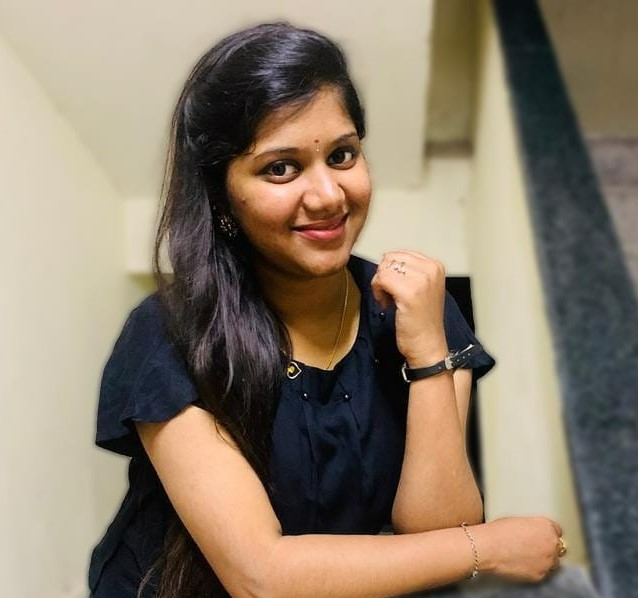

# Divya Sarvepalli

I've completed my undergraduation specialized in Computer Science and then joined Infosys as Systems Engineer Trainee. Later, became **Systems Engineer** and worked in a project as called Torrid in Support Team. My total experience in **Infosys** is 15months and then decided to do my Masters in Computer Science as I'm from the same background from first. I'm very much interested in Web Applications from my UG and I've done Certified Course on ***Programming Foundations with JavaScript, HTML, CSS*** from **Coursera**. Looking forward to learn and become proficient in Web Applications!

